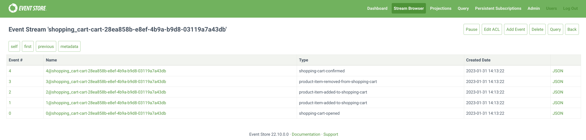

# event-sourcing-using-eventstoredb

An example on how implement an [event-sourcing](https://martinfowler.com/eaaDev/EventSourcing.html) application using Typescript adn [EventStoreDB](https://www.eventstore.com/eventstoredb).

<!-- TOC -->
* [event-sourcing-using-eventstoredb](#event-sourcing-using-eventstoredb)
  * [How-to](#how-to)
    * [Setup and launch the project](#setup-and-launch-the-project)
<!-- TOC -->

## Setup and launch the project

1 - Clone the repository and install the dependencies

```shell
$ git clone https://github.com/zankyr/event-sourcing-using-eventstoredb.git
$ cd event-sourcing-using-eventstoredb
$ npm install
```

2 - Start the Docker container containing EventStoreDB

```shell
$ npm run docker:start
```

3 - Start the application

```shell
$ npm run dev:start
```

4 - In the terminal you should see something similar:

```shell
user in ~/dev/src/event-sourcing-using-eventstoredb on main [?]
$ npm run dev:start

> event-sourcing-using-eventstoredb@1.0.0 dev:start
> npx ts-node src/index.ts

{
  id: 'cart-28ea858b-e8ef-4b9a-b9d8-03119a7a43db',
  clientId: 'client-123',
  openedAt: 2023-01-31T13:13:22.649Z,
  productItems: [ { productId: 'team-building-exercise-2023', quantity: 3 } ],
  status: 2,
  confirmedAt: 2023-01-31T13:13:22.649Z
}

```

5 - In your browser, open the address [http://localhost:2113/](http://localhost:2113) to reach the EventStoreDB GUI and check the stream:



## Try the scenarios
Currently, the project has two scenarios:
1. Checkpoint 1: a static event stream is loaded when the application is launched
2. Checkpoint 2: events are created through API calls